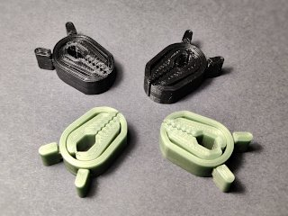
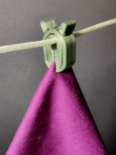
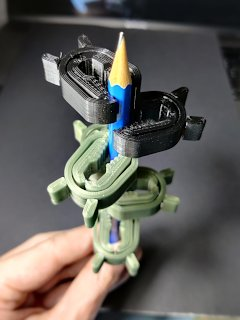

# Mini Clamp Print-in-place
*3D printable ready-to-use mini clamp or clothespin*

### License
[Creative Commons - Attribution](https://creativecommons.org/licenses/by/4.0/)

### Gallery

[🔎](images/photo1.jpg) [🔎](images/photo2.jpg) [🔎](images/photo3.jpg)

## Description and Instructions

This is a print-in-place small clamp or clothespin, that requires no assembly or external springs. The working principle is inspired by [muzz64's ‘Germz’](https://www.thingiverse.com/thing:3495390). The outer part of the clamp acts as the spring.

It comes in 2 variants, one with the ‘jaws’ in a zig-zag interlocking design, which is best for grabbing thin objects or cloth, and one with symmetric jaws, best for grabbing wires or thin sticks.

### Printing

The recommended material is PETG, because it is good at retaining its ‘springiness.’ ABS or ASA may also be OK. PLA has a tendency to ‘creep’ under tension, and also to become brittle and break over time.

You should use at least 3 perimeters when printing at an extrusion width of 0.6 mm, or 4 perimeters with an extrusion width of 0.4 mm. Infill is not terribly important, I used 15%.

The models with `xtraTol` in their name have a slightly larger clearance between the overhangs. If the regular models end up fused, try printing the `xtraTol` models instead.

Scaling up should work fine, scaling down could be problematic as the tolerances are designed to be pretty tight at normal scale.

## Licensing: what to do when selling prints

If you want to print and sell this model, keep in mind that it is released under a [Creative Commons Attribution license](https://creativecommons.org/licenses/by/4.0/). My interpretation of this license is the following.

* If you **sell or give away prints** of this model, you need to **provide attribution.** This means you must always provide *a clearly visible reference* to the source of the model, both on the webpage where you sell or display the model, and on a piece of paper included with each physical product. **This is a very easy requirement** that does not incur any significant extra cost. Here is an example of a full attribution message:\
  “[Mini Clamp Print-in-place by DrLex](https://github.com/DrLex0/print3d-mini-clamp) on GitHub, released under a [*Creative Commons Attribution* license](https://creativecommons.org/licenses/by/4.0/).”\
  For the required attribution message on your website/store, simply copy the above line, ensure the hyperlink to this GitHub page is preserved (or re-add it), and you're done.\
  As for the physical printed object, put a similar message on a piece of paper. Print it, write it, 3D print it, I don't care as long as it's there. Simplest is to use the ready-to-print attribution cards in PDF format that can be found in this repository.
* If you **remix** this model and you sell prints of that remix, the origin should be attributed as described in the previous point. You can change the message to: *“Based on Mini Clamp Print-in-place by DrLex.”* You don't need to use the same attribution cards, but it must be obvious that your prints were derived from my model, and must provide a link to this GitHub page.
* You are *not* obliged to make the 3D model for a **remix** available, this is not a `SA` license. If you do publish the 3D model, it must have the same `CC BY` license or a more restrictive one. You must provide a visible link to this GitHub page wherever your remixed model is published.
* You **do not need to ask explicit permission** from me to sell prints of this model or a remix. Just do the above. Of course it is fine for you to drop me a message, but you don't need to.
* You **do not need to share profits,** although of course you may. [On my site you can find a few ways to donate](https://www.dr-lex.be/about/#contact), should you want to.

### Practical: when displaying this model on a webpage or in a video

To comply with the [Creative Commons Attribution license](https://creativecommons.org/licenses/by/4.0/), you need to provide *attribution,* which is really simple.

* If you display **photos** of the 3D model or 3D printed copies on a webpage: add the same kind of attribution message as when selling objects. In other words, this one:\
  “[Mini Clamp Print-in-place by DrLex](https://github.com/DrLex0/print3d-mini-clamp) on GitHub, released under a [CC BY license](https://creativecommons.org/licenses/by/4.0/).”\
  If there really is no way to provide hyperlinks, the above line of text, possibly as a text overlay in the image, suffices because it contains enough information for people to find this source page, but you must provide links when possible.
* If you show the model or prints of it in a **video:** include the same message, either spoken, in a text overlay, or in the video's ‘end credits.’ If the video has a separate textual description, add the same message with link as above.
